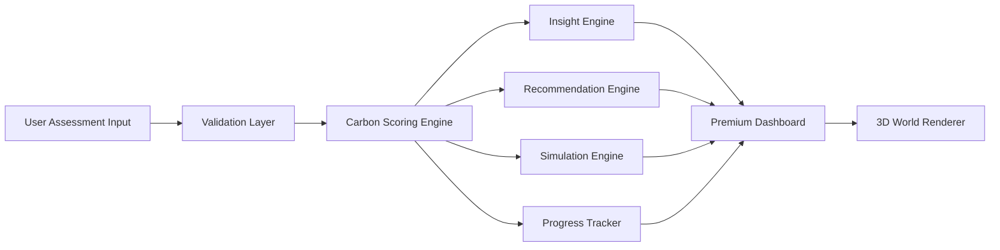

# 🌍 CarbonCraft 3D Premium
### Understand. Track. Reduce. Transform.

> A premium 3D climate intelligence experience that helps individuals **understand, track, and reduce their carbon footprint** through **simple actions** and **personalized insights**.

**🚀 Live Demo:** [https://carbon-craft.vercel.app/](https://carbon-craft.vercel.app/)

  
  
  
  
  

---

## ✨ Overview

**CarbonCraft 3D Premium** is not just a carbon calculator — it is an **immersive behavior-change platform**.

It transforms personal lifestyle inputs into a **living 3D world** that visually reflects environmental impact in real time. Instead of showing users only numbers and charts, it creates a premium interactive experience where every decision influences the ecosystem.

Users can:

- **Understand** which habits drive their footprint
- **Track** progress over time
- **Reduce** impact with simple, realistic actions
- **Explore** “what-if” scenarios in a live 3D simulation
- **Stay motivated** through premium gamification and insights

---

## 🧩 Challenge Statement

Design a solution that helps individuals:

- **understand**
- **track**
- **reduce**

their carbon footprint through:

- **simple actions**
- **personalized insights**

CarbonCraft 3D directly addresses this by combining:
- intuitive assessment
- explainable carbon scoring
- actionable recommendations
- immersive 3D environmental storytelling

---

## 🏢 Chosen Vertical

We have chosen the **Individual Carbon Footprint Tracking & Sustainable Lifestyle Gamification** vertical. The platform acts as a smart, personal climate intelligence assistant designed to translate abstract carbon stats into an engaging, real-world visual experience.

---

## ⚙️ Approach and Logic

Our core approach focuses on replacing passive, text-heavy calculator interfaces with an **active, interactive cause-and-effect learning loop**:

1.  **Guided Contextual Onboarding**: We establish an initial carbon footprint baseline using a validated Zod schema.
2.  **Immersive 3D Feedback**: Using React Three Fiber, we link the user's score to a 3D island's state. When scores shift, material colors, lighting, and environmental effects (sparkles vs smoke clouds) interpolate smoothly.
3.  **Local state What-If Simulation**: Users toggle a "What-If" simulator to slide and adjust parameters (e.g. going vegan, commuting via bike), seeing scoring and 3D responses instantly before committing to changes.
4.  **Zustand Gamification**: Ranks, XP rewards, and achievement badges are calculated and persisted to LocalStorage to drive daily habits and streaks.

---

## 💡 How the Solution Works

*   **Assessment & Validation Layer**: Standard inputs (transport mode, utility usage, diet type, flights, waste recycle levels) are parsed using Zod to enforce security boundaries.
*   **Scoring Engine**: Computes exact kg CO2e metrics for each category (e.g. transport, flights) using verified emission multipliers.
*   **Insight Engine**: Scans categories to find the user's highest emission source and generates a dynamic NLP suggestion.
*   **3D World Renderer**: Passes the computed score state to Three.js meshes, which lerps base colors (emerald healthy green, warm orange, stone-gray polluted) and atmospheric shaders in real time.

---

## 📝 Assumptions Made

*   **Grid Emission Factor**: We assume an average grid multiplier of `0.5 kg CO2e` per kWh for mixed fossil-based power.
*   **Flight Emissions**: Short/medium flights are calculated at an average factor of `250 kg CO2e` per flight.
*   **Streaks**: streaks are rewarded daily based on distinct Calendar Date changes checked against the local timezone.

---

## 🏆 Why This Solution Stands Out

### CarbonCraft 3D Premium is designed to win by combining:

- **Elite UI/UX polish**
- **Interactive 3D world-building**
- **Real-time simulation**
- **Actionable and personalized recommendations**
- **Progress tracking**
- **Accessibility and performance optimization**
- **Clean architecture and strong code quality**

This makes the product memorable to both:
- **AI judges**
- **real users**

---

# 🎯 Core Features

## 1. Smart Carbon Footprint Assessment
Users answer a simple guided assessment covering:

- Transportation
- Home Energy
- Diet
- Shopping / Consumption
- Waste / Recycling
- Flights / Travel

The system then calculates:

- total footprint score
- category-wise breakdown
- primary emission source
- awareness-focused estimate

> **Disclaimer:** CarbonCraft 3D provides indicative estimates for awareness and habit improvement. It is not a certified carbon accounting tool.

---

## 2. Real-Time 3D Environmental Visualization
The experience is centered around an **interactive 3D world**.

### Environmental States
- **Low Footprint** → vibrant, green, clean, healthy
- **Medium Footprint** → mixed environment
- **High Footprint** → polluted, foggy, stressed ecosystem

### Dynamic 3D Reactions
- sky tone shifts
- lighting changes
- vegetation health changes
- smoke / fog intensity updates
- clean energy elements appear or disappear
- smooth transitions between world states

---

## 3. Personalized Insights
The platform identifies the most meaningful signals in the user’s behavior, such as:

- biggest emission category
- easiest place to improve
- highest-impact future action
- trend direction over time

Examples:
- “Transport is your largest contributor.”
- “Reducing solo car use gives the fastest improvement.”
- “Small home energy changes can produce immediate gains.”

---

## 4. Personalized Action Plan
Recommendations are grouped for clarity and usability:

### Quick Wins
Low-friction changes users can adopt immediately.

### Weekly Habits
Repeatable lifestyle improvements over time.

### Deep Impact Changes
Long-term shifts with stronger reduction potential.

Each action includes:
- category
- effort level
- impact level
- explanation
- benefit framing

---

## 5. Simulation Mode
One of the strongest differentiators of the project.

Users can test:

- What if I switch to public transport?
- What if I reduce meat consumption?
- What if I lower home energy use?
- What if I travel less by air?

The app instantly updates:
- score
- category contribution
- recommendations
- 3D world

This creates a powerful **cause-and-effect learning loop**.

---

## 6. Progress Tracking
Users can track:

- baseline footprint
- current footprint
- trend over time
- score improvement
- completed actions
- sustainability streaks
- reduction goals

---

## 7. Gamification
To keep the experience motivating and premium:

- eco levels
- XP / progress points
- streaks
- achievement badges
- visual milestones
- subtle celebration animations

Example levels:
- Beginner
- Aware
- Reducer
- Guardian
- Planet Hero

---

# 🎨 Design Philosophy

## Premium Dark Theme
The design system uses layered dark surfaces rather than flat dark panels.

### Visual Style
- deep navy / near-black background
- elevated blue-gray surfaces
- cyan / teal highlight glow
- glassmorphism panels
- premium spacing and typography
- smooth motion transitions

### Experience Goal
The interface should feel like:

- **Apple-quality polish**
- **Stripe-like clarity**
- **futuristic sustainability**
- **startup-grade product design**

---

# 🧠 UX Principles

CarbonCraft 3D follows key product design principles:

- **Clarity over complexity**
- **Visual storytelling over static dashboards**
- **Actionability over abstraction**
- **Encouragement over guilt**
- **Immersion over plain data display**
- **Elegant motion over noisy animation**

---

# 🏗️ System Architecture

## High-Level Architecture

